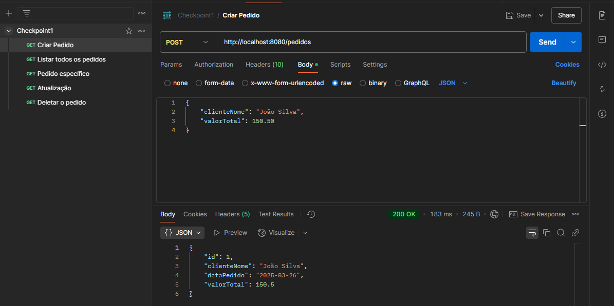
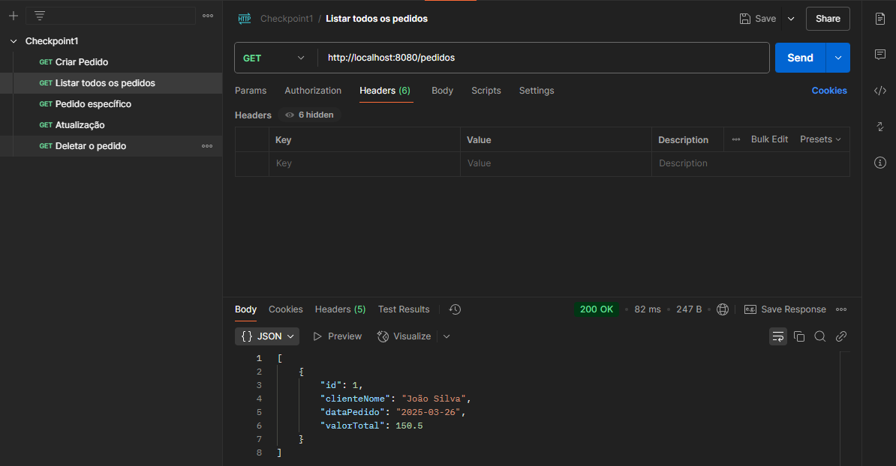
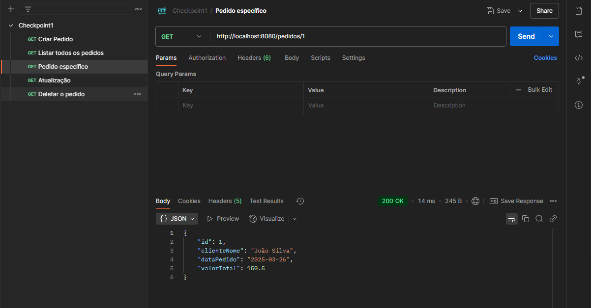
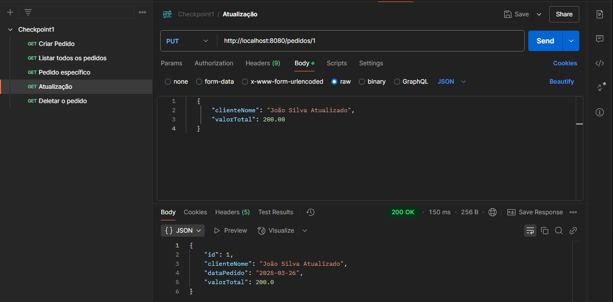
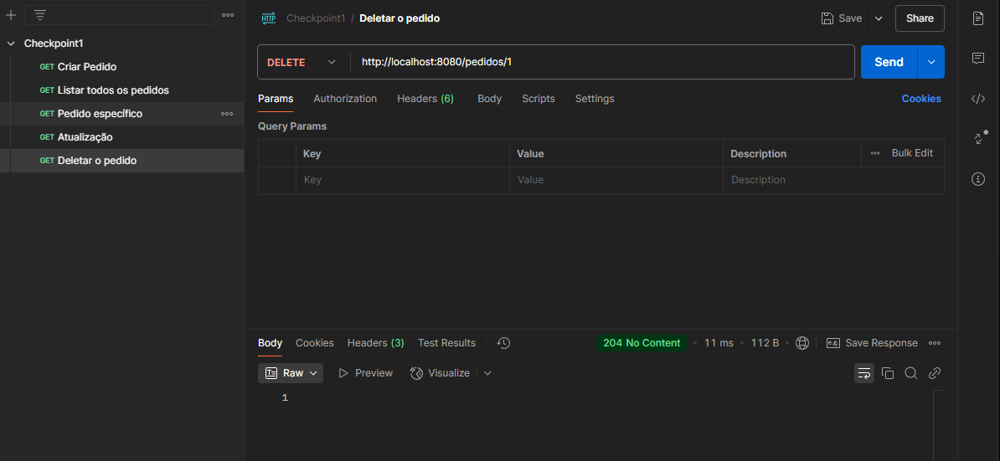

# API de Pedidos - Checkpoint 1

API REST desenvolvida com Spring Boot para gerenciamento de pedidos.

## Requisitos

- Java 17
- Maven
- Spring Boot 3.1.5

## Configuração

1. Clone o repositório
2. Execute o projeto com Maven:
```bash
mvn spring-boot:run
```

## Endpoints

### Listar Todos os Pedidos
- **GET** `/pedidos`
- Retorna a lista de todos os pedidos cadastrados

### Buscar Pedido por ID
- **GET** `/pedidos/{id}`
- Retorna um pedido específico pelo ID

### Criar Novo Pedido
- **POST** `/pedidos`
- Cria um novo pedido
- Exemplo de corpo da requisição:
```json
{
    "clienteNome": "João Silva",
    "valorTotal": 150.50
}
```

### Atualizar Pedido
- **PUT** `/pedidos/{id}`
- Atualiza um pedido existente
- Exemplo de corpo da requisição:
```json
{
    "clienteNome": "João Silva Atualizado",
    "valorTotal": 200.00
}
```

### Deletar Pedido
- **DELETE** `/pedidos/{id}`
- Remove um pedido pelo ID

## Banco de Dados

O projeto utiliza o H2 Database em memória. O console H2 está disponível em:
- URL: `http://localhost:8080/h2-console`
- JDBC URL: `jdbc:h2:mem:pedidosdb`
- Usuário: `sa`
- Senha: `password`

## Validações

- O nome do cliente é obrigatório
- O valor total do pedido deve ser positivo
- A data do pedido é preenchida automaticamente com a data atual

## Testes Realizados

### 1. Criar Novo Pedido (POST /pedidos)


### 2. Listar Todos os Pedidos (GET /pedidos)


### 3. Buscar Pedido por ID (GET /pedidos/{id})


### 4. Atualizar Pedido (PUT /pedidos/{id})


### 5. Deletar Pedido (DELETE /pedidos/{id})


## Resultado dos Testes

Todos os endpoints foram testados com sucesso:

1. **Criar Pedido**: ✅ Status 200 OK - Pedido criado com sucesso
2. **Listar Pedidos**: ✅ Status 200 OK - Lista retornada com sucesso
3. **Buscar Pedido**: ✅ Status 200 OK - Pedido encontrado
4. **Atualizar Pedido**: ✅ Status 200 OK - Pedido atualizado com sucesso
5. **Deletar Pedido**: ✅ Status 204 No Content - Pedido deletado com sucesso 